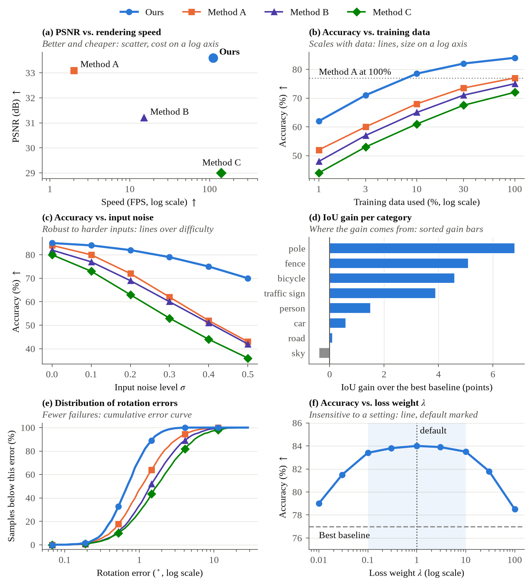
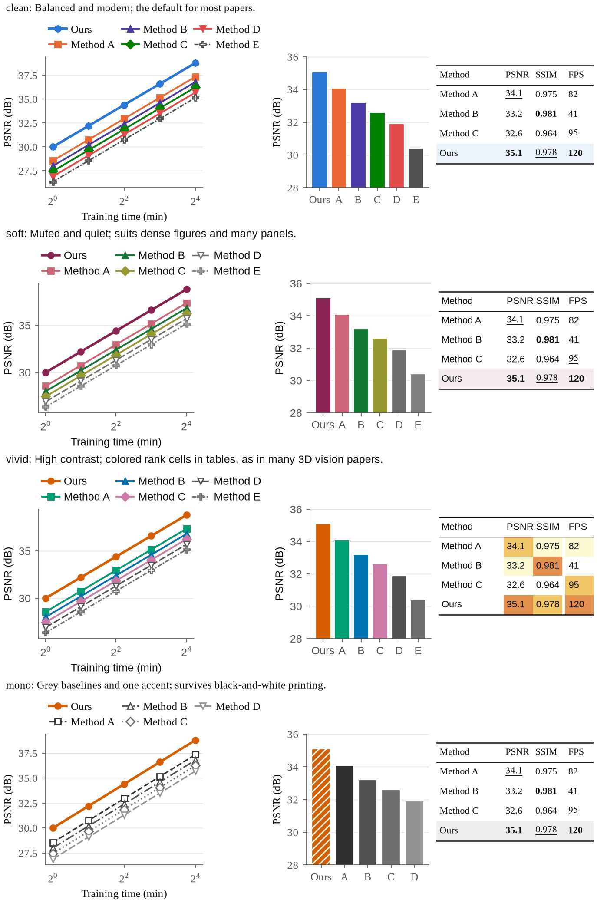

# Skills: Research Paper Writing

[中文介绍](./README_zh.md).

> Important Attribution
> Most writing knowledge and methodology in this repository comes from Prof. Peng Sida (彭思达)'s open study notes:
> https://pengsida.notion.site/c1a22465a0fa4b15a12985223916048e
> Prof. Peng's original repository:
> https://github.com/pengsida/learning_research
> I sincerely thank Prof. Peng for openly sharing these valuable experiences.
> My contribution is organization, structured adaptation, and packaging as reusable Skills.

## Repository Overview

This repository currently provides one skill package:

- `research-paper-writing/`
  - `SKILL.md`: core workflow, usage rules, and the writing and typesetting rules applied to every edit
  - `references/`: section-specific writing guides and templates
  - `scripts/check_tex.py`: rule checker the agent runs after every edit (Python 3, standard library only). It ends with a pass/fail list of the parts every paper must have (venue and template, Appendix, closest-work reproductions, at least 3 figures, metrics before results), which the agent copies into its reply
  - `scripts/paperstyle.py`: figure and table style schemes (matplotlib settings, fixed method colors, LaTeX table macros)
  - `scripts/figure_forms.py`: one plot form for each common message (trade-off, scaling, robustness, per-category gain, error distribution, sensitivity), drawn with `paperstyle`
  - `scripts/figure_qa.py`: checks every figure after drawing (legend over data, overlapping or cut-off content, text and markers too small or too large, empty axis ranges and margins, titles that state a conclusion) and writes a preview to look at
  - `agents/openai.yaml`: agent metadata

Typical use cases:

- Drafting or rewriting Abstract / Introduction / Method / Experiments / Conclusion
- Improving paragraph flow and section logic
- Checking claim-evidence alignment
- Running pre-submission self-review from a reviewer mindset

## Figures and Tables

Before drawing, the agent writes the message of a figure in one sentence and picks the form that shows it. For example, "better and cheaper" calls for a scatter with cost on a log axis. "Where the gain comes from" calls for sorted gain bars. The table of messages and forms, worked examples, and forms to avoid are in `research-paper-writing/references/figure-table-styles.md`. The agent records each figure and table as one line of a figure plan (`label: message -> form`), and uses one form for at most two main-text figures. Captions first say what the figure shows, then what each part shows, then the conclusion in at most two sentences, within 50 words (80 for a teaser or pipeline figure). Tables follow `research-paper-writing/references/table-types.md`: SOTA comparison, plug-in, ablation, efficiency, and more. After drawing, `scripts/figure_qa.py` checks every figure, and the checker rejects any image not checked since its last change. `scripts/figure_forms.py` draws each form (illustrative data below):



The skill defines four style schemes: `clean` (default), `soft`, `vivid`, and `mono` (black-and-white print). The agent uses one scheme for every figure and table in a paper and asks you to choose if you have not. Details: `research-paper-writing/references/figure-table-styles.md`.



## Installation

Assume you are in the repository root.

These commands copy the skill, so an installed copy does not change when you update this repository. After updating, delete the installed folder and copy it again, or install it once with `ln -s "$PWD/research-paper-writing" <skills-dir>/` instead of `cp -R`.

### 1) Codex

Copy the skill into `$CODEX_HOME/skills/`:

```bash
mkdir -p "$CODEX_HOME/skills"
cp -R research-paper-writing "$CODEX_HOME/skills/"
```

Usage example:

```text
Use $research-paper-writing to improve my paper's Introduction.
```

### 2) CC (Claude Code)

Use either a global or project-level installation.

Global:

```bash
mkdir -p "$HOME/.claude/skills"
cp -R research-paper-writing "$HOME/.claude/skills/"
```

Project-level:

```bash
mkdir -p .claude/skills
cp -R research-paper-writing .claude/skills/
```

In prompts, explicitly request this skill, for example: `Please use the research-paper-writing skill`.

### 3) Gemini

Copy this skill into your Gemini skills directory:

```bash
mkdir -p "$HOME/.gemini/skills"
cp -R research-paper-writing "$HOME/.gemini/skills/"
```

Then ask concrete tasks in Gemini (for example, rewriting an Abstract with claim-evidence checks).

## Credits

Again, this repository is primarily based on Prof. Peng Sida (彭思达)'s open notes, while my work focuses on curation and Skills adaptation.
Prof. Peng's original repository: https://github.com/pengsida/learning_research

## License

This project is licensed under the MIT License. See [LICENSE](./LICENSE).
