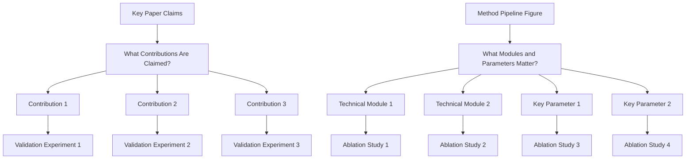
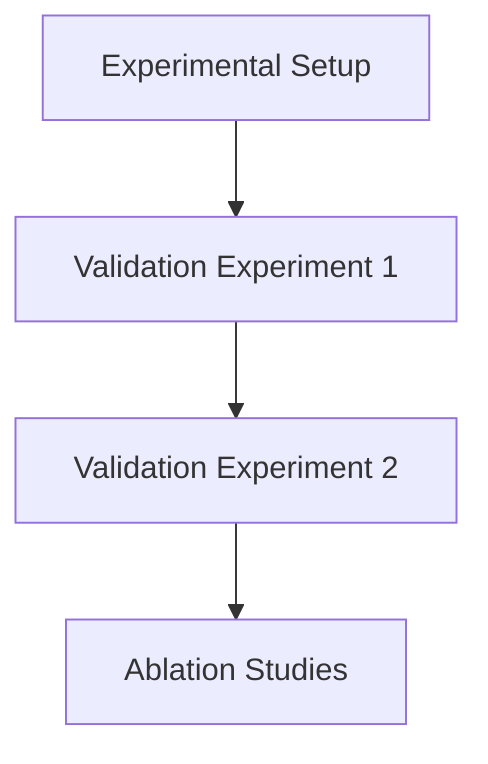

# Experiments Writing Guide

Start from the `% Story:` block (`references/story.md`): the Experiments test the story's claims in turn. Every figure and table names its claim in the figure plan (`[C1]`), and the text says what each result means for the story.

Then reread this section in each style reference (`references/style-references.md`), and follow its structure, length, and tone. The templates and examples below only fill what they leave open.

## Goal

Convince reviewers with complete evidence on effectiveness, causality, and practical value.

## Three Core Questions

1. Is the method better than strong baselines?
   - Run comparison experiments against strong and recent baselines.
   - Report standard metrics on the main benchmark(s).
   - Include SOTA or strongest public methods, not only weak baselines.
   - Keep protocol fair (same data split, preprocessing, and evaluation settings).
2. Which modules/design choices make the gain?
   - Run ablation studies for each key module/design choice.
   - Use remove/replace/disable variants and report delta to full model.
   - Include component interaction ablations when modules are coupled.
3. How far can the method generalize under harder settings?
   - Run demos/evaluations on harder or out-of-distribution settings.
   - Add stress-test scenarios (more complex scenes, rarer cases, noisier inputs, or stricter constraints).
   - Find the settings and subsets where ours gains the most, and show them. Never discuss where ours loses (`references/story.md`, Find the Evidence).

## Experiment Planning

Every figure and table must show an advantage of our method or a non-obvious finding (Writing Rule A2.1 in `SKILL.md`). Beyond the analyses of the closest work, look for where ours differs most: hard cases where baselines fail, trade-offs (quality against speed, memory, or data), scaling with data or model size, robustness to noise or sparse input, and per-category breakdowns that show where the gain comes from. Search every result you have for evidence of the story, even a few scenes or one subset (`references/story.md`, Find the Evidence). Before making a figure or table, write its one-line conclusion; if you cannot, do not make it. Then pick the form that shows that conclusion from the table in `references/figure-table-styles.md`.

Whenever the paper has an Experiments section, write the closest-work plan before writing Experiments or making any figure or table (Core Workflow step 2 in `SKILL.md`). The checker verifies it and reports every gap as an ERROR.

1. Name the 1-3 closest prior works: the methods ours is most directly compared with.
2. Open each paper, including its supplementary material, and count its figures and tables. Use the alphaXiv tools, the web, or PDFs from the user; if you cannot open a paper, ask the user for its PDF or link. The closest works are usually style references too, so reuse their PDFs and sheets (`references/style-references.md`).
3. Give every figure and table of each paper one line. Reproduce it under the same setting (dataset, split, metrics, protocol) with ours included, in the main text or the Appendix. Skip one only when the analysis does not apply to our setting, e.g., their own pipeline figure, and write why. Turn their failure-case figure into a comparison on the same hard inputs, where ours succeeds. If ours fails there too, skip it ("-> skipped: it shows failure cases, which our paper does not discuss").
4. Missing data is never a reason to skip: create the figure or table now, and run the experiment behind it (Run Missing Experiments, below). Until its results exist, use `[TODO]` cells or a placeholder box that states the planned message.
5. Record the plan as a comment block at the start of the Experiments section. Start with one count line per closest paper (main-paper figures and tables). Each reproduced item names the label of our figure or table, which must exist in the paper or the Supplementary Material. Items that share a target can share a line, and supplementary items (`Supp. Fig. 3`) may be listed too:

   ```latex
   % Closest-work plan:
   % PaperA (Author et al., CVPR 2024): 5 figures, 3 tables
   % PaperA Fig. 1 (teaser: quality vs. speed) -> fig:teaser: done; shows ours is faster at equal quality
   % PaperA Fig. 2 (their pipeline) -> skipped: it shows their architecture, which ours replaces
   % PaperA Fig. 3 (qualitative comparison) -> fig:qualitative: TODO render the four scenes; shows ours keeps thin structures
   % PaperA Fig. 4 (PSNR vs. views) -> fig:views: TODO run 3/6/9 views; shows our lead grows as the views get sparser
   % PaperA Fig. 5 (their failure cases) -> fig:hard: TODO render their two failure scenes; shows ours recovers both
   % PaperA Tab. 1 (main comparison) -> tab:main: done; shows ours has the best PSNR
   % PaperA Tab. 2 (ablation) -> tab:ablation: TODO run w/o deformation; shows each module matters
   % PaperA Tab. 3 (training time and memory) -> tab:cost: TODO measure on one GPU; shows ours trains fastest
   ```

   The checker reports an ERROR when the block or a count line is missing, when a figure or table of a counted paper has no line, when a planned label does not exist, and when a skip has no reason or blames missing data. A section is not a reproduction: a figure or table is reproduced as a figure or table.

6. Run every experiment the plan needs, or log why it is blocked (Run Missing Experiments, below).

Then find the latest state of the art, which is often newer than the closest work:

1. Search the main benchmark for the strongest methods of the past 12 months: recent proceedings of the top venues in the field, arXiv, and benchmark leaderboards.
2. Add the strongest one to the main comparison table, with its own row and citation. If you cannot run it, copy its numbers from its paper into that table and mark them with † (`references/table-types.md`, rule 3), even if its protocol differs slightly. A one-line table note and a short clause in the text are enough; never put reported numbers in a separate table.
3. Discuss it in the text: where ours beats it, by how much, and why. Where it leads, let the table show that without comment, and sell where ours is better, e.g., hard cases, speed, or memory.
4. Record it in the closest-work plan block; the checker verifies each line:

   ```latex
   % Latest SOTA: MethodY (Author et al., CVPR 2026) -> tab:main: done; discussed in Sec. 4.2
   % Latest SOTA: MethodZ (Author et al., ICCV 2025) -> not comparable: it needs multi-view input, while ours is monocular
   ```

   Leave a method out only when it solves a different task or needs different input. Missing code, missing numbers, or a different protocol is not a reason.

## Run Missing Experiments

When the paper needs a result that does not exist yet, run the experiment yourself; do not leave it for the author. This covers a claim of the story, an item of the closest-work plan, the latest SOTA, an ablation, or any `[TODO]` in a table or figure.

1. Log it: one line per experiment in an `% Experiment log:` block next to the closest-work plan, with the claim it serves and the figure or table it fills.
2. Check what it needs: the method's code (usually in the project), the datasets, the baselines' official code, the compute (`nvidia-smi`), and a time estimate.
3. Run it when you can. Put the script in the project (e.g., `experiments/`), fix the seeds, and test it on a small subset first. Write the results to a file, e.g., `results/views.json`, and keep the command and the commit hash in the log. Run long jobs in the background and check on them.
4. Fill the table or figure from the result files, by script when there are many numbers. A number in the paper comes from a result file or from a cited paper (marked †); never invent, estimate, or round it in your favor.
5. When something is missing, ask the user for exactly that with the ask-user tool: access to the code, a dataset path, a GPU, or approval for a run longer than about an hour. Until then, keep the `[TODO]` and mark the experiment blocked.

```latex
% Experiment log:
% E1 [C2] PSNR vs. number of input views on D-NeRF -> fig:views: done; results/views.json (python experiments/views.py, commit 3f2a1c9)
% E2 [C3] ablation without feature sharing -> tab:ablation: running; logs/ablation.out
% E3 [C1] MethodY on D-NeRF -> tab:main: blocked: its code needs 8 GPUs and this machine has none; asked the user for a GPU or its numbers
```

The checker reports an ERROR when a table or figure has a `[TODO]` result but no log line. It also reports one when a done experiment names no existing result file, or its table or figure still has a `[TODO]`. It warns about running experiments, and about blocked ones that do not say what is missing or that the user was asked.



## Experiment Section Decomposition



## Experimental Setup

Write the setup before any result, even when earlier sections already covered parts of it: many readers jump straight to Experiments.

1. Datasets and benchmarks: cite each again at its first mention in Experiments (Writing Rule A4.6 in `SKILL.md`), and give the split and resolution.
2. Baselines: cite each again at its first mention here and in every table row that names it. Say how its results were obtained: official code, numbers from its paper, or retrained by us.
3. Metrics (Writing Rule A4.9): explain every metric in a table or figure anywhere at the start of Experiments, before the first result. Say in one short sentence what it measures and which direction is better. Cite its source paper when it has one (SSIM, LPIPS, FID, BLEU, ...), and restate it even if the Introduction or Method already did.
4. Implementation details: hardware, training time, and key hyperparameters; move the rest to the Appendix.
5. Statistical significance (Writing Rule B4.5): one sentence at most, such as the standard deviation over seeds, or a pointer to the tests in the Appendix (`references/table-types.md`, Statistical Significance).

```latex
\paragraph{Metrics.} We report PSNR, SSIM~\cite{wang2004ssim}, and LPIPS~\cite{zhang2018lpips}. PSNR measures pixel-wise fidelity in dB. SSIM measures structural similarity, and LPIPS measures perceptual distance with deep features. Higher PSNR and SSIM and lower LPIPS are better. We measure FPS at $800\times800$ on one RTX 4090 GPU.
```

## Figure/Table Writing Rules

Pick each table's type (SOTA comparison, plug-in, ablation, efficiency, and others) from `references/table-types.md`, and each figure's form from `references/figure-table-styles.md`.

`Good tables are part of experiment communication quality, not decoration.`

1. Figure captions and table captions are equally important in the writing quality of Experiments.

### Hard rules

1. Put caption above the table.
2. Avoid vertical lines (`|`) in tabular columns.
3. Do not use double rules or dense `\hline` stacks.
4. Use `booktabs` style (`\toprule`, `\midrule`, `\bottomrule`) for clean structure.
5. Use as few horizontal rules as possible; lines should separate groups, not every row.
6. Highlight best and second-best numbers and the row of ours with the macros of the chosen style scheme (`references/figure-table-styles.md`).

### Readability rules from review practice

1. Label metric direction in column headers (for example `PSNR ↑`, `LPIPS ↓`).
2. Add units when needed so values are interpretable without guessing.
3. Align text columns left; keep numeric columns consistently aligned.
4. Keep numeric precision consistent (same decimal places within a metric column).
5. Group multi-dataset or multi-setting results using `\multicolumn` + `\cmidrule`, not vertical separators.
6. One table, one message: do not mix unrelated results in a single table.
7. If rows represent different attributes/ablations, encode that explicitly in row names or attribute columns.
8. Captions (Writing Rule A2.4 in `SKILL.md`): first what the table or figure shows, then (a)/(b) for its parts, then the conclusion in at most 2 short sentences. Keep it within 50 words, with no formatting notes such as "best in bold" (`references/figure-table-styles.md`, Write the Caption).
9. Analyze every figure and table in the text: the observation with numbers, the reason ours behaves this way, and what follows. A figure or table that the text never discusses should be cut.
10. For single-column figures/tables in two-column papers, prefer placing them in the right column when layout allows, so readers can enter the page from the left-top text without breaking reading flow.

### Minimal LaTeX checklist

1. Add packages in preamble: `\usepackage{booktabs}`, `\usepackage{colortbl,xcolor}` (and optionally `\usepackage{siunitx}` for decimal alignment).
2. Replace `\hline`-heavy style with `\toprule/\midrule/\bottomrule`.
3. Put `\caption{...}` before `\label{...}` and keep caption above.
4. Use restrained highlighting; never color too many cells.

## Recommended Ablation Package

1. One core ablation table for all major contributions.
2. Several focused mini-ablations for module-level design choices.
3. Matching qualitative visual results for each important ablation.

## Experimental Rigor Checklist

1. Are baselines recent and relevant?
2. Are metrics sufficient and standard for this task?
3. Is ablation tied to every key design claim?
4. Are claims in Abstract/Introduction supported by reported numbers?
5. Is every claim scoped to the data that supports it, and does the text sell the strengths without discussing weaknesses?
6. Is every metric defined, with its direction and source, before the first result?
7. Is every baseline, dataset, and metric cited at its first mention in Experiments and in each table row that names it?
8. Does the main table include the latest state of the art, and does the text discuss it?
9. Is statistical significance one sentence in the main text, with the details in the Appendix?
