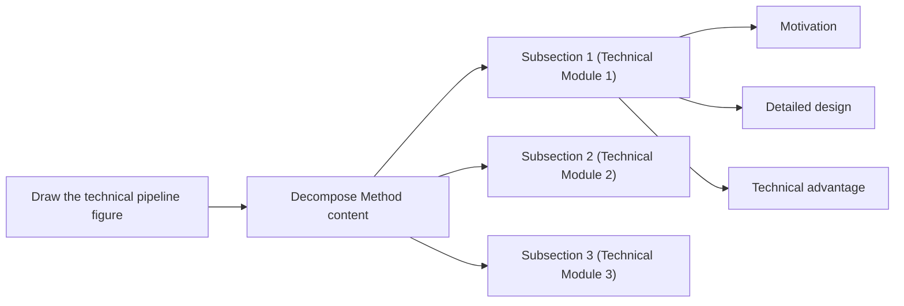
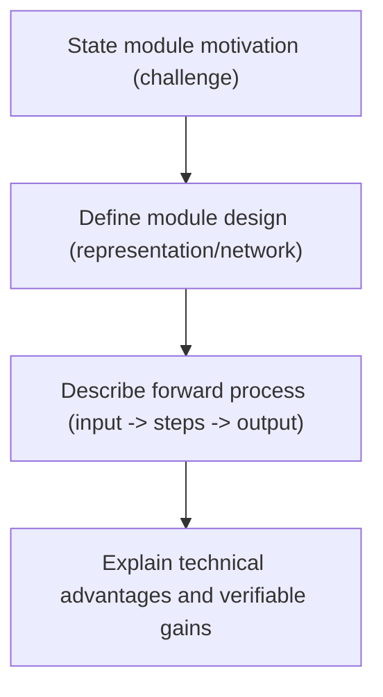

# Method Writing Guide

Start from the `% Story:` block (`references/story.md`): motivate every module by the story's problem, and show how it realizes the insight. Cut or move to the Appendix what serves neither.

Then reread this section in each style reference (`references/style-references.md`), and imitate its vibe, such as its structure, length, tone, and pace, in your own sentences. Never copy its sentences or specific content. The templates and examples below are secondary and only fill what the references leave open.

## Goal

Write the Method section clearly by following this sequence:

1. Answer key method-design questions.
2. Sketch the architecture, then generate the architecture figure (The Architecture Figure, below).
3. Write the method section step by step.

## Pre-Writing Questions

`Before writing Method, first answer: (1) what modules exist in the method, and (2) for each module, what is the workflow, why this module is needed, and why this module works.`

Recommended organization:

1. List all modules in the pipeline.
2. For each module, answer three questions:

- How does the module run?
- Why do we need this module?
- Why does this module work?

3. Organize answers as a mind map or a table for clarity.

## Method Writing Steps

`Method writing steps: (1) sketch the architecture and generate its figure, (2) map subsections from the figure, (3) plan each subsection with motivation/design/advantages, (4) write module design first, (5) then add motivation and technical advantages.`

Step-by-step workflow:

1. Sketch the architecture, and generate the architecture figure from the sketch.
2. Use the figure to organize the Method subsections, one per module or stage.
3. For each subsection, plan three parts: motivation, module design, and technical advantages.
4. Write module design first to build a concrete backbone.
5. Add motivation and technical advantages afterward.

## The Architecture Figure

Every Method section has an architecture figure (Writing Rule A2.10 in `SKILL.md`). Readers study it before they read the section, so it shows the whole method at a glance: the inputs, each module under the name the text uses, the data flow between the modules, the outputs, and the training losses where they matter. Like every figure, it must look good and convince (`references/figures.md`).

1. Sketch it first. Fix the order of the modules from left to right, the arrows between them, and the groups, such as the stages or the trainable and frozen parts. Add its line to the figure plan, e.g., `% fig:arch: how the method works -> architecture diagram`.
2. Write a detailed prompt for the image-generation tool. Ask for a clean, flat academic diagram on a white background in the layout of the sketch, and specify every block with its exact label, every arrow, one color per stage that matches the other figures, and the aspect ratio of the printed figure (about 2:1 to 3:1 for a `figure*` across both columns). Ask for no text beyond the given labels, no 3D effects, and no decoration.
3. Generate the figure with `generate_image`, or with the environment's equivalent tool if it has another name, at the largest size the tool offers. Save the prompt next to the image, e.g., `figures/arch.prompt.txt`, so that the figure can be regenerated when the method changes.
4. Open the result at full size, and check every label letter by letter against the text, every arrow, and the order of the modules. Image models often misspell words, so keep the labels short, and regenerate with a corrected prompt until the figure is right.
5. Save it in the figure folder, e.g., `figures/arch.png`, crop any white border, and include it at `\textwidth` in a `figure*` at the start of the Method section. Refer to it in the Overview, and run `scripts/figure_qa.py` on it.
6. If the tool is missing, returns an error, or still produces wrong labels or structure after three attempts, ask the user with the ask-user tool. State what failed, include the prompt, and offer three options: the user supplies the figure, the user enables an image-generation tool, or you draw the figure as a vector diagram in TikZ. Until the user answers, the checker keeps reporting the missing figure, so the loop cannot end without it.

The checker reports an ERROR when the Method section neither contains nor references an architecture figure, that is, a figure whose figure-plan form is a diagram (architecture, pipeline, overview, or framework) or whose caption names one of these words in its first sentence.

## Three Elements of a Pipeline Module

`A pipeline module has three elements: Module design, Motivation of this module, and Technical advantages of this module.`

### 1) Module Design

Definition:

1. Describe representation/network/data-structure details.
2. Describe the forward process clearly: given input -> step 1 -> step 2 -> step 3 -> output.

### 2) Motivation of This Module

Definition:

1. Explain why this module is needed.
2. Use problem-driven logic: because problem X exists, we design module Y.

### 3) Technical Advantages of This Module

Definition:

1. Explain why this module has technical advantage over alternatives.
2. Tie advantage to measurable behavior when possible.

### Example of the Three Elements

Local cite:

1. `references/examples/method/example-of-the-three-elements.md`

## Method Content Decomposition



## How to Write Module Design

`Module design usually has two parts: (1) describe specific data/network structures, and (2) describe forward process as input -> steps -> output.`

Writing structure:

1. Define key structures first (representation, network, data structure).
2. Write forward process in strict execution order.
3. End with output interpretation or purpose.

Sentence skeleton:

1. `We represent ... with ...`
2. `Given [input], we first ... then ... finally ...`
3. `This produces [output], which is used for ...`

Local cite:

1. `references/examples/method/module-design-instant-ngp.md`

## How to Write Module Motivation

`Module motivation is usually problem-driven: because a problem exists, we design xx to solve it.`

Typical opening sentences:

1. `A remaining problem/challenge is ...`
2. `However, we ...`
3. `Previous methods have difficulty in ...`

Local cite:

1. `references/examples/method/module-motivation-patterns.md`

## How to Check Whether Method is Easy to Understand

`Check method clarity from three levels: writing logic, paragraph writing, and sentence writing.`

### 1) Logic-level check

1. After finishing the paper, summarize the Method writing logic again.
2. Check whether this summarized logic is smooth and easy to follow.

### 2) Paragraph-level check

1. The first sentence of each paragraph should make readers immediately understand what this paragraph is about.
2. One paragraph should clearly deliver one message.

### 3) Formatting check

1. Use bold run-in headings (`\paragraph{...}` or `\textbf{...}` opening a paragraph) sparingly: only where the reader needs to find a part again. Never give every paragraph one; subsection titles and clear first sentences already guide the reader (Writing Rule B4.6 in `SKILL.md`).
2. Never write "It is A, not B" or "X is not A but B": state what it is (Writing Rule B3.2).

### 4) Sentence-level check

1. Carefully check whether the **motivation** of each sentence is explicit. Keep one thing clear to readers at all times: **why this sentence content is needed**.
2. Carefully check sentence-to-sentence flow.
3. Carefully check term consistency and avoid changing key terms back and forth.

## Method Section Skeleton

```latex
\section{Method}
% Overview
% (Optional) Preliminaries, if not a separate section: see references/preliminary.md
% Section 3.1
% Section 3.2
% Section 3.3
```

Local cite:

1. `references/examples/method/section-skeleton.md`

## Overview Subsection

`Overview should include: setting, core contribution, a pointer to the architecture figure, and a map of what each subsection contains.`

Writing structure:

1. One to two sentences for task setting.
2. One to two sentences for core contribution.
3. Point to the architecture figure, and walk through it from input to output.
4. Tell readers what Section 3.1/3.2/3.3 covers.

Local cite:

1. `references/examples/method/overview-template.md`

## Section 3.1 and Other Module Subsections

`Basic subsection logic: (1) motivation of this module, (2) module forward process/module design, (3) technical advantages of this module.`

Local cite:

1. `references/examples/method/example-of-the-three-elements.md`

## Module Writing Pattern (Mermaid)



## Optional Components

Add these only when they help readers understand or trust the method:

1. Algorithm (pseudocode): for multi-stage or iterative procedures that prose describes poorly; use the same notation as the text.
2. Theorem / Proposition: for key theoretical properties; state the assumptions, and put long proofs in the Appendix.
3. Complexity analysis: when efficiency is a claimed advantage.
4. Training vs. inference: when the two procedures differ.
5. Discussion of other methods: how ours differs from or generalizes the closest methods, and design choices reviewers will ask about.

## Implementation Details

`Implementation details include hyperparameters (e.g., layer count, feature dimensions), coordinate transforms/normalization, and other practical details. Put them near the end of Method or in a dedicated Implementation Details section.`

## Example Bank

1. `references/examples/method-examples.md`
2. `references/examples/method/pre-writing-questions.md`
3. `references/examples/method/module-triad-neural-body.md`
4. `references/examples/method/module-design-instant-ngp.md`
5. `references/examples/method/module-motivation-patterns.md`
6. `references/examples/method/section-skeleton.md`
7. `references/examples/method/overview-template.md`
8. `references/examples/method/example-of-the-three-elements.md`
9. `references/examples/method/method-writing-common-issues-note.md`
